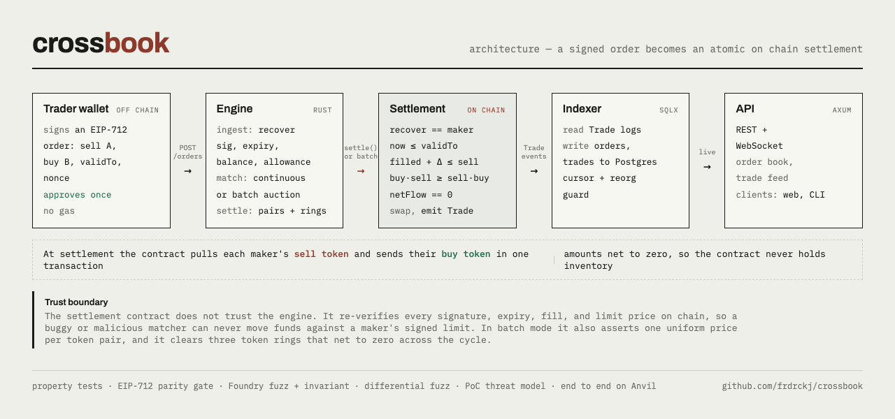

# Crossbook

[](https://github.com/frdrckj/crossbook/actions/workflows/ci.yml)



Crossbook is a noncustodial hybrid decentralized exchange. Traders sign orders offchain as gasless intents, a Rust matching engine crosses them, and an onchain settlement contract checks the signatures and swaps the tokens in one atomic transaction.

Funds stay in the trader's wallet until the moment of execution. A maker grants the settlement contract an ERC-20 allowance once, and the contract pulls tokens only when it settles, after it has independently checked every signature, nonce, expiry, and limit price onchain.

## How it works

1. A maker signs an order with EIP-712. There is no gas and no onchain action.
2. The maker posts the signed order to the engine, which validates the signature, the expiry, the nonce, and the maker's balance and allowance.
3. The engine inserts the order into an in memory book. A pure matching core crosses it against resting liquidity and produces a settlement batch.
4. The engine submits the batch to the settlement contract.
5. The contract checks every signature, nonce, expiry, and limit price again, then atomically pulls each maker's sell token and sends their buy token. It reverts wholesale on any failure, so it never holds inventory.
6. An indexer reads the resulting events, writes them to Postgres, and pushes updates to WebSocket subscribers.

## Matching modes

Crossbook matches in one of two modes, chosen by config and never both at once. Continuous mode, the default, crosses each order against the book as it arrives at price time priority. Batch mode collects orders over a window and clears each token pair at one uniform price, a call auction in the CoW style, so every order in a pair trades at the same price and a later arrival gets no worse a fill. The contract verifies that single price per pair onchain and emits a settlement event for it. Set `MATCHING_MODE` to continuous or batch and `BATCH_INTERVAL` to the window length in seconds.

Batch mode also clears **ring trades**: three orders that each sell one token and buy the next form a cycle (A to B to C to A) and all trade with no external liquidity, even though no two share a pair. This is the multi token coincidence of wants an order book cannot express. Rings net to zero across their tokens and respect every maker's limit, so they settle through the same contract with no special trust. The clearing algorithms are written up in [docs/architecture.md](docs/architecture.md).

## Design

- The exchange is noncustodial. Traders never deposit into the engine. They approve the settlement contract once, and it pulls tokens only at execution, the same trust model as CoW Protocol.
- The matching core is pure and deterministic. A single writer task owns it, and it has no async, no I/O, and no clock, which makes the hot path fast and the whole engine easy to test and replay.
- The contract does not trust the engine. It independently rechecks signatures, nonces, expiry, and each maker's limit price, so a buggy or malicious matcher cannot move funds against a maker's signed limits.
- The Rust and Solidity EIP-712 digests are identical, proven by a cross language parity test that gates all settlement work.
- Two matching modes share one settlement path. Continuous price time priority, or a uniform price batch auction in the CoW style whose single clearing price per pair is enforced onchain, not trusted from the solver.
- Security is a first class concern. The repo carries property tests, Foundry fuzz and invariant suites, and a threat model rather than treating them as an afterthought.

## Stack

Rust on Tokio. Alloy for Ethereum, not `ethers-rs`, which is deprecated. axum for the REST and WebSocket API. sqlx with PostgreSQL. Foundry and Solidity 0.8.24 with OpenZeppelin. proptest and criterion for property tests and benchmarks. tracing with a Prometheus metrics endpoint.

## Layout

```
crates/crossbook-core     pure matching engine (no I/O, no async)
crates/crossbook-engine   Tokio service: REST and WebSocket, ingest, settle, indexer
crates/crossbook-cli      client: approve, sign, submit, query
contracts/                Foundry project: CrossbookSettlement and OrderLib
docs/                     architecture, order schema, threat model, benchmarks
```

## Prerequisites

The Rust stable toolchain, [Foundry](https://book.getfoundry.sh/), [just](https://github.com/casey/just), and Docker. Copy `.env.example` to `.env` for local devnet keys, which are Anvil test keys only.

## Develop

```sh
just            # list tasks
just check      # fmt, clippy, cargo test, forge test (the CI gate)
just dev        # docker compose up: Postgres and Anvil
just bench      # matching core benchmarks
```

## Testing

The matcher is covered by property tests for its invariants (no crossed book, conservation, cumulative limit respect, exact partial fill accounting, and fill or kill), a check of the price math against exact rational arithmetic, a golden replay for determinism, and an assertion that the hot path does not allocate. The batch auction adds property tests for one price per pair, quantity conservation and net to zero, maximal crossable volume, and determinism, a golden coincidence of wants clearing at the midpoint, and a check that the batch captures at least the surplus continuous matching would. Ring clearing has a golden three token ring and a property test over random cycles for net to zero, limits, and determinism. The settlement contract has a Foundry suite of unit, fuzz, and invariant tests covering every revert path, fee on transfer tokens, reentrancy, zero inventory, and the onchain uniform price assertion. A cross language test proves the Rust and Solidity order digests match byte for byte, and a cross implementation differential test fuzzes random batches through the Rust core and the live Solidity contract on Anvil and asserts they always agree.

## Security

The settlement contract is the trust backstop, not the engine. It verifies each order onchain, enforces every maker's limit price with overflow safe arithmetic, tracks cumulative fills to prevent replay and overfill, and requires each settlement to net to zero so the contract never custodies funds. See [docs/threat-model.md](docs/threat-model.md).

## License

MIT.
